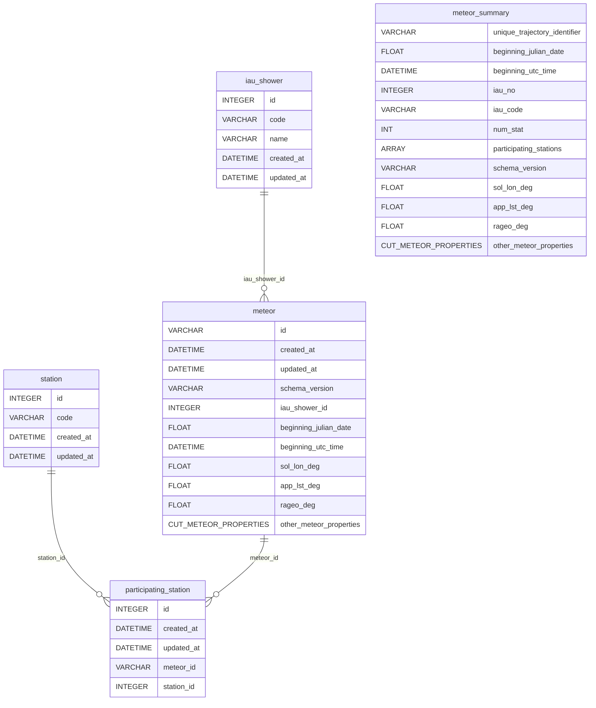

# Database Schema

The tables are generated using the `gmn_python.meteor_summary_schema.get_meteor_summary_avro_schema()` function. `meteor_summary` is an SQLite database view and provides a flat view of all the other meteor related tables. The view includes columns similar to [GMN Data Directory](https://globalmeteornetwork.org/data/) CSVs. The meteor_summary view can be selected using [functions](https://gmn-python-api.readthedocs.io/en/latest/autoapi/gmn_python_api/meteor_summary_reader/index.html#gmn_python_api.meteor_summary_reader.read_meteor_summary_csv_as_dataframe) provided in the `gmn_python_api` package to load meteor data into [Pandas](https://pandas.pydata.org/) DataFrames or [NumPy](https://numpy.org/) arrays through the [GMN REST API](https://github.com/gmn-data-platform/gmn-data-endpoints).

Note that for the diagram `CUT_METEOR_PROPERTIES other_meteor_properties` represents all the other meteor summary properties found in the `gmn-python-api` [Data Schemas](https://gmn-python-api.readthedocs.io/en/latest/data_schemas.html) docs page. Details about the columns can also be found in the Data Schemas page.
